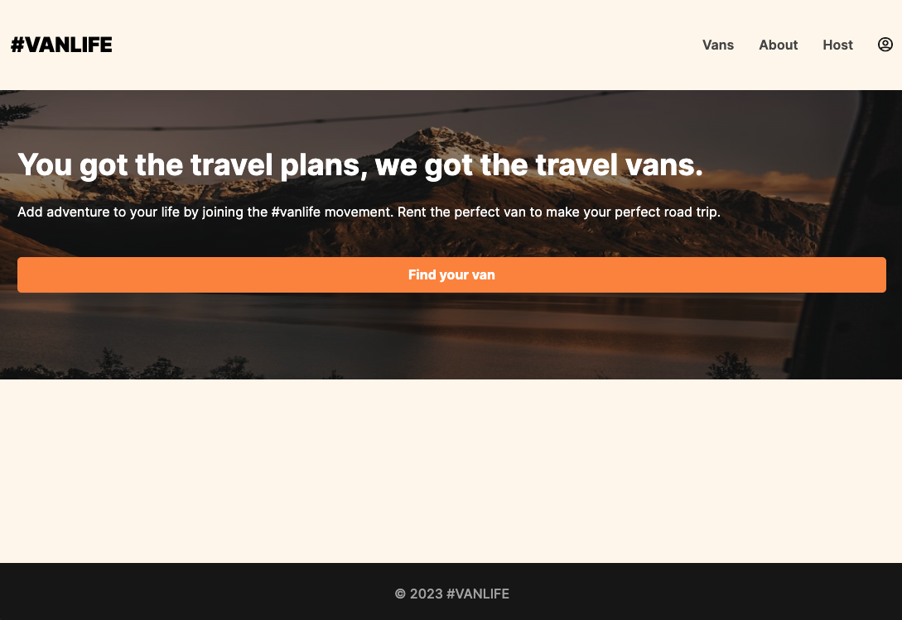
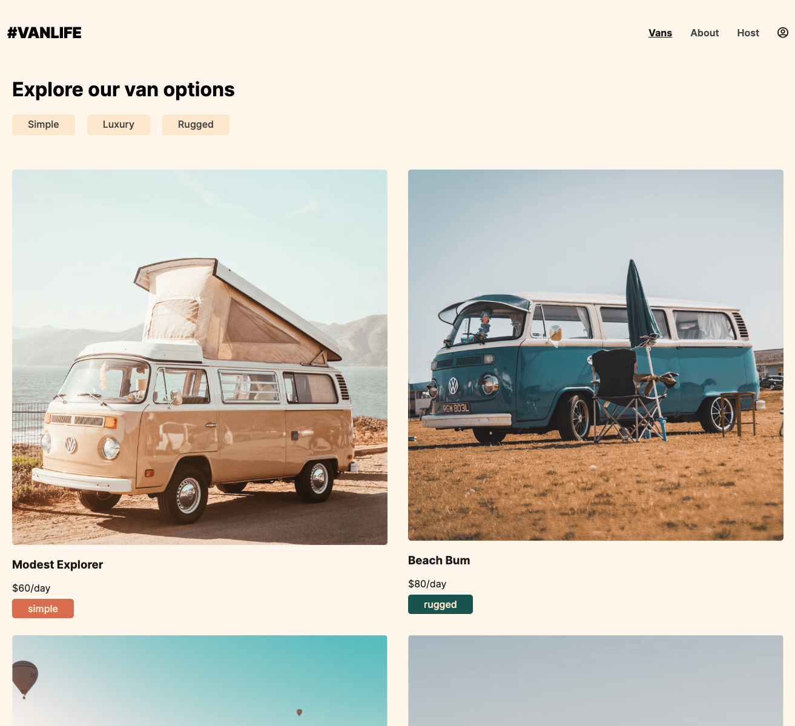

# Van Life :red_car:

## [Live Demo](https://geofarl.github.io/van-life/)

This is a simple website built to practice and learn react-router 6

## About project

Here I've worked with a SPA, used loaders and actions.
A lot of different react-router hooks have been used such as:

- useLocation
- useLoaderData
- useActionData

and a lot of others

I've introduced myself to the concept of protected routes and used Await router component coupled with Suspense React component to fetch data smoothly with loading state

Here I've used Firebase to store my vans data

## Website Images

